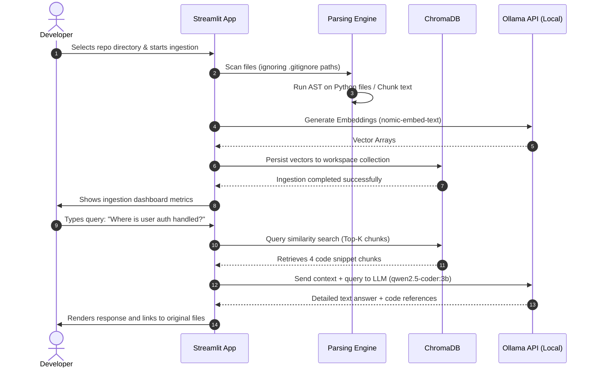

# 🧠 DeepDive AI — Project Cheatsheet

DeepDive AI is a local-first, private, and AI-powered repository and document analysis system. It empowers developers and researchers to instantly understand complex codebases and large text datasets using Semantic Search and Retrieval-Augmented Generation (RAG).

---

## 📌 1. Problem Statement
In modern software engineering and data analysis, codebases and document repositories grow in size and complexity at an exponential rate. 
* **Information Overload:** Developers spend up to **70% of their time reading and understanding code** rather than writing it.
* **Limitations of Keyword Search:** Standard search tools (like `grep` or IDE search) are limited to character-level matches and cannot grasp context, intent, or code architecture patterns.
* **Privacy & Security Risks:** Uploading proprietary code bases, business documents, or sensitive client files to public cloud-based AI tools violates intellectual property rights and data compliance policies.
* **Dependency Tracing:** Tracking down how changes in one module propagate to another requires manually walking through imports, leading to overhead and errors.

---

## 💡 2. Solution
**DeepDive AI** provides a fully local, secure, and privacy-compliant environment to ingest, parse, search, and chat with any repository or document corpus.
* **Privacy-First (100% Offline):** Runs models locally using Ollama and indexes them in a local vector database. No data ever leaves the machine.
* **Semantic Comprehension:** Translates text/code queries into vector spaces to capture context, meaning, and associations.
* **Interactive Code Chat:** Answers high-level queries spanning multiple files, generates documentation, and traces variables or routes.
* **Visual Graph Rendering:** Generates import dependency mappings and module relation graphs to visually trace code paths.

---

## 🛠️ 3. Tech Stack
The application is built on top of a lightweight, highly efficient, and modular Python ecosystem:

| Component | Technology | Description |
| :--- | :--- | :--- |
| **Frontend UI** | **Streamlit** | Multi-page responsive web dashboard for uploading, chatting, and viewing charts. |
| **Orchestration** | **LangChain** | Document loading, text/code splitting, prompt management, and QA memory chains. |
| **Vector DB** | **ChromaDB** | Locally-persisted vector database for fast similarity searches. |
| **Local LLM Engine** | **Ollama** | Manages local LLM processes (e.g., `qwen2.5-coder:3b`, `gemma2:2b`) and embedding generators (e.g., `nomic-embed-text`). |
| **Core Utilities** | **Python AST, NetworkX** | Static analysis of Python code structures, import statement tracing, and graph networks. |
| **Data Parsing** | **PyMuPDF, docx2txt** | Fast text extraction from PDF and DOCX files. |

---

## 🏗️ 4. Architecture
DeepDive AI separates ingestion, vector storage, and generation into clean, decoupled pipelines:

```mermaid
graph TD
    subgraph Ingestion Layer
        A[Local Repository / Files] --> B[File Parser & Filter]
        B --> C[AST Static Analyzer / Splitter]
    end

    subgraph Vector Database Layer
        C --> D[nomic-embed-text Embeddings]
        D --> E[(ChromaDB Local Vector Store)]
    end

    subgraph Retrieval & Generation (RAG) Layer
        F[User Query via Streamlit] --> G[Hybrid Searcher]
        E --> G
        G --> H[Relevant Context & Memory]
        H --> I[Local LLM via Ollama]
        I --> J[Answer & Source Citations]
    end

    style E fill:#00e5a0,stroke:#333,stroke-width:2px
    style I fill:#0066ff,stroke:#333,stroke-width:2px
```

---

## 🔄 5. User Flow
The following sequence details how a developer uses DeepDive AI to analyze a codebase:



---

## ✨ 6. Key Features
* **Code-Aware Splitting:** Understands block syntax (classes, functions, import headers) during chunking, preventing chunks from being split in the middle of a logical block.
* **Multi-Page Dashboard:** Structured pages for **Workspace Ingestion**, **Interactive Code Chat**, and **Architecture Visualizer**.
* **AST Dependency Engine:** Scans files to extract module dependencies and automatically graphs file relationships using `NetworkX` and `Graphviz`.
* **Traceable Citations:** Every answer references the source file names and line numbers of the code blocks it extracted.
* **Custom Output Generation:** Export structural summaries, markdown documentation, or code refactor reports directly to the `output/` folder.

---

## 📅 7. Milestones & Implementation Roadmap

```
  Milestone 1: Project Setup (Days 1-2)
  ├── Setup Python environment & pip dependencies
  └── Build multi-page Streamlit layout & configuration sidebar

  Milestone 2: Ingestion & Parser Engine (Days 3-4)
  ├── Build custom code parser (Python AST & language-specific files)
  └── Implement smart .gitignore parsing & directory scanner

  Milestone 3: Vector Store Setup (Days 5-6)
  ├── Configure local ChromaDB instance
  └── Integrate Ollama embedding generator (nomic-embed-text)

  Milestone 4: RAG Chat & Retrieval (Days 7-9)
  ├── Implement ConversationalRetrievalChain with memory
  └── Build custom prompt templates for code understanding

  Milestone 5: Dependency Graphing & Insights (Days 10-11)
  ├── Extract import maps and map modules using NetworkX
  └── Implement code complexity metrics dashboard

  Milestone 6: Polishing & Validation (Days 12-14)
  ├── Add formatting tools, error boundary handlers
  └── Write tests and build local deployment workflow
```

---

## 🗂️ 8. Folder Structure
The workspace is organized as follows:

```
DeepDive-AI/
├── app.py                     # Main application entrypoint & routing logic
├── requirements.txt           # Python dependency declarations
├── README.md                  # Public project overview
├── CHEATSHEET.md              # Project architecture & cheatsheet (This file)
├── pages/                     # Streamlit multi-page interface routes
│   ├── 1_📂_Ingestion.py      # Folder uploads, file filtering, & database building
│   ├── 2_💬_Code_Chat.py      # Conversational Q&A page with source citations
│   └── 3_📊_Visualizations.py  # Dependency trees and module mapping graphs
├── utils/                     # Modular backend utility files
│   ├── parser.py              # Directory scanners, AST extractors, & splitters
│   ├── vectorstore.py         # ChromaDB interface and embedding helpers
│   ├── retriever.py           # Retrieval chains, memory buffers, & prompting
│   └── visuals.py             # NetworkX graphs and stream statistics visualizers
└── output/                    # Exported markdown documentations and audit files
```

---

## 🔌 9. API Requirements
DeepDive AI connects to a local instance of Ollama via its HTTP REST API:

### 1. Embeddings Endpoint (`POST /api/embeddings`)
Generates numerical vectors for raw text/code chunks.
* **Payload:**
  ```json
  {
    "model": "nomic-embed-text",
    "prompt": "import streamlit as st\n..."
  }
  ```

### 2. Chat Completions Endpoint (`POST /api/chat`)
Generates context-grounded code/text responses.
* **Payload:**
  ```json
  {
    "model": "qwen2.5-coder:3b",
    "messages": [
      {
        "role": "user",
        "content": "Using the following context...\nQuestion: How does parser.py handle files?"
      }
    ],
    "options": {
      "temperature": 0.2
    }
  }
  ```

---

## 🔮 10. Future Scope
* **Language Support Expansion:** Integrate AST parsers for TypeScript, Rust, and Go to achieve first-class code block analysis.
* **Agentic Workflows:** Support AI Agents that write test suites, refactor deprecated modules, or fix lint errors and verify they pass locally.
* **Real-time File Observers:** Utilize file system watchers (`watchdog`) to automatically update vector databases when a file is edited.
* **Git Webhooks:** Integrate direct remote cloning and webhook triggers for continuous documentation updates.
